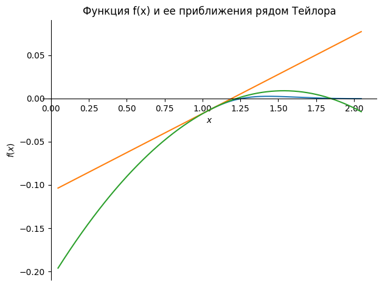
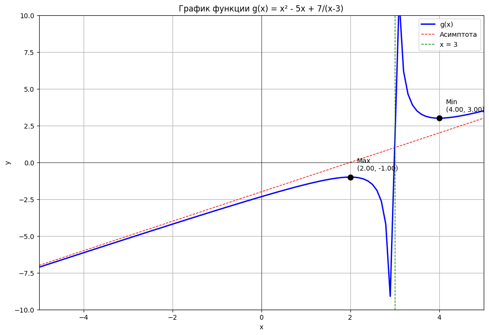
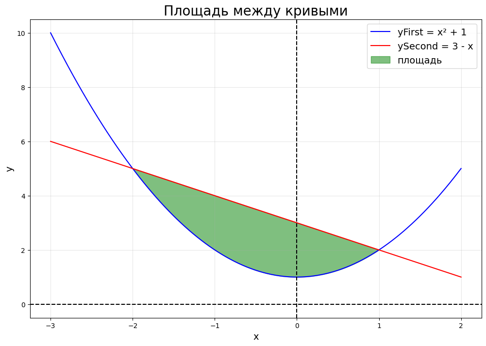
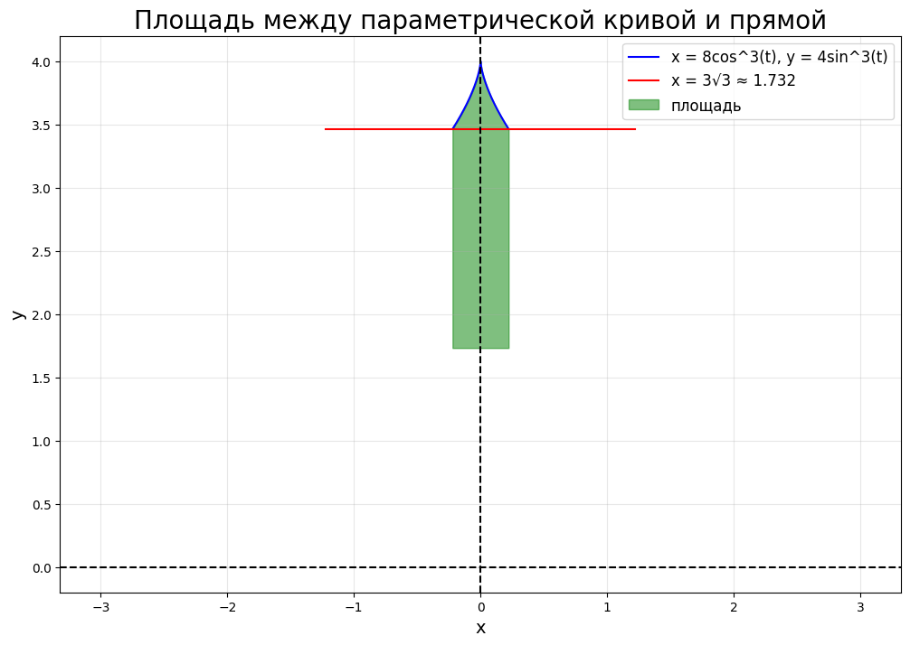
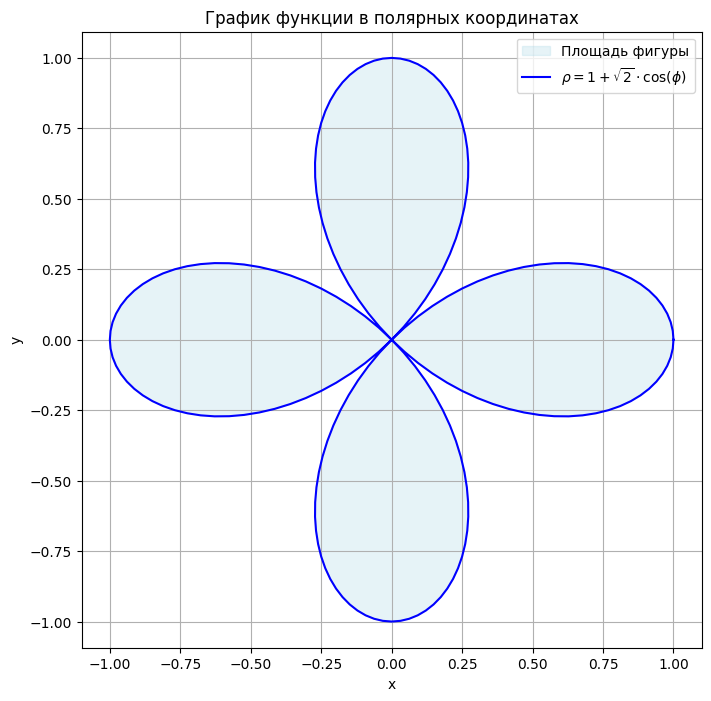
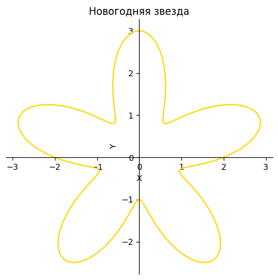

# Зимняя практика 2024 года

## Подключение библиотек
``` python
import sympy as sym
from sympy import init_printing
from IPython.display import display, Math
from sympy.physics.control.control_plots import plt
```

# Оглавление
[1. Решение задач алгебры](#i-решение-задач-алгебры)  
[2. Математический анализ](#ii-математический-анализ)  
[3. Обыкновенные дифференциальные уравнения](#iii-обыкновенные-дифференциальные-уравнения)  
[4. Нахождение площади между заданными кривыми. Визуализация](#iiii-нахождение-площади-между-заданными-кривыми-визуализация)  
[5. Новогодний элемент](#iiiii-новогодний-элемент)

# I. Решение задач алгебры 
1. **Задание 1**
- создание матрицы
    ``` python
  a = sym.Symbol('a')
  A = sym.Matrix([[2, 3*a, 0], [3*a, 1, -3], [0, -3, 1]]) # создание матрицы
  display(A) # вывод матрицы
  ```
$$
A = \begin{pmatrix}
2 & 3a & 0 \\
3a & 1 & -3 \\
0 & -3 & 1
\end{pmatrix}
$$
- поиск определителя матрицы
   ``` python
   determinant_A = A.det()
   display(determinant_A) # вывод определителя матрицы А
   ```
$$
\text{Определитель матрицы А равен}\ -9a^2 - 16
$$
- поиск транспонированной матрицы
   ``` python
   transpose_A = A.transpose()
   display(transpose_A) # вывод транспонированной матрицы
   ```
$$
A^T = \begin{pmatrix} 
2 & 3a & 0 \\
3a & 1 & -3 \\
0 & -3 & 1
\end{pmatrix}
$$
- поиск обратной матрицы
   ``` python
   if determinant_A != 0:
     inverseA = A.inv()
     display(inverseA) # вывод обратной матрицы

     identityMatrix = A * inverseA
     identityMatrix = sym.simplify(identityMatrix)
     display(identityMatrix)
   ```
$$
\text{inverseA} \cdot A = \begin{pmatrix}
\frac{8}{9a^2 + 16} & \frac{3a}{9a^2 + 16} & \frac{9a}{9a^2 + 16} \\
\frac{3a}{9a^2 + 16} & \frac{-2}{9a^2 + 16} & \frac{-6}{9a^2 + 16} \\
\frac{9a}{9a^2 + 16} & \frac{-6}{9a^2 + 16} & \frac{9a^2 - 2}{9a^2 + 16}
\end{pmatrix} \cdot \begin{pmatrix}
2 & 3a & 0 \\
3a & 1 & -3 \\
0 & -3 & 1
\end{pmatrix} = \begin{pmatrix}
1 & 0 & 0 \\
0 & 1 & 0 \\
0 & 0 & 1
\end{pmatrix} = \text{identityMatrix}
$$

2. **Задание 2**
- первая матрица
  ``` python
  x1, x2, x3 = sym.symbols('x1 x2 x3')
    
  coefficientMatrix = sym.Matrix([[2, -1, 0], [-1, -3, 1], [0, 1, -3]]) # матрица коэффициентов
  X = sym.Matrix([x1, x2, x3])
  B = sym.Matrix([[2], [3], [0]])
    
  display(Math(r'Матрица\ коэффициентов\ A:'))
  display(coefficientMatrix)
  display(Math(r'Вектор\ неизвестных\ X:'))
  display(X)
  display(Math(r'Вектор\ свободных\ членов\ B:'))
  display(B)
    
  coefficientMatrixHat = coefficientMatrix.row_join(B)
  display(coefficientMatrixHat)
    
  rankCoefficientMatrix = coefficientMatrix.rank() # ранг матрицы коэффициентов
  rankCoefficientMatrixHat = coefficientMatrixHat.rank()  # ранг расширенной матрицы
    
  display(Math(r'Ранг\ матрицы\ коэффициентов\ A:'))
  display(rankCoefficientMatrix)
  display(Math(r'Ранг\ расширенной\ матрицы\ \hat{A}:'))
  display(rankCoefficientMatrixHat)
    
  if rankCoefficientMatrix == rankCoefficientMatrixHat:
      if rankCoefficientMatrix == coefficientMatrix.shape[1]: # ранг равен числу переменных
          display(Math(r'Система\ имеет\ единственное\ решение:'))
      else:
          display(Math(r'Система\ имеет\ бесконечно\ много\ решений'))
  else:
      display(Math(r'Система\ не\ имеет\ решений'))
    
  if rankCoefficientMatrix == rankCoefficientMatrixHat and rankCoefficientMatrix == coefficientMatrix.shape[1]:
      solution = coefficientMatrix.LUsolve(B)
      display(Math(r'Решение\ системы\ X:'))
      display(solution)
  ```
   
Матрица коэффициентов \( coefficientMatrix \):

$$
coefficientMatrix =
\begin{pmatrix}
2 & -1 & 0 \\
-1 & -3 & 1 \\
0 & 1 & -3
\end{pmatrix}
$$
    
Вектор неизвестных \( X \):
    
$$
X =
\begin{pmatrix}
x_1 \\
x_2 \\
x_3
\end{pmatrix}
$$
    
Вектор свободных членов \( B \):
    
$$
B =
\begin{pmatrix}
2 \\
3 \\
0
\end{pmatrix}
$$

Расширенная матрица \( coefficientMatrixHat \):

$$
coefficientMatrixHat =
\begin{pmatrix}
2 & -1 & 0 & 2\\
-1 & -3 & 1 & 3\\
0 & 1 & -3 & 0\\
\end{pmatrix}
$$

Ранг матрицы коэффициентов \( coefficientMatrix \):

$$
\text{rank}(coefficientMatrix) = rankCoefficientMatrix
$$

Ранг расширенной матрицы \( rankCoefficientMatrixHat \):

$$
\text{rank}(\hat{coefficientMatrixHat}) = rankCoefficientMatrixHat
$$

Ранг матрицы `coefficientMatrix` равен 3

Ранг расширенной матрицы `coefficientMatrixHat` равен 3


Система имеет единственное решение:

$$
\text{solution} =
\begin{pmatrix}
\frac{7}{19} \\
\frac{-24}{19} \\
\frac{-8}{19}
\end{pmatrix}
$$
- вторая матрица
     ``` python
     x1, x2, x3 = sym.symbols('x1 x2 x3')
    
     coefficientMatrix = sym.Matrix([[2, -1, 0], [-1, -3, 1], [1, -4, 1]])
     X = sym.Matrix([x1, x2, x3])
     B = sym.Matrix([[2], [3], [3]])
     display(Math(r'Матрица\ коэффициентов\ A:'))
     display(coefficientMatrix)
     display(Math(r'Вектор\ неизвестных\ X:'))
     display(X)
     display(Math(r'Вектор\ свободных\ членов\ B:'))
     display(B)
     coefficientMatrixHat = coefficientMatrix.row_join(B)
    
     rankCoefficientMatrix = coefficientMatrix.rank() # ранг матрицы коэффициентов
     rankCoefficientMatrixHat = coefficientMatrixHat.rank() # ранг расширенной матрицы
    
     display(Math(r'Ранг\ матрицы\ коэффициентов\ A:'))
     display(rankCoefficientMatrix)
     display(Math(r'Ранг\ расширенной\ матрицы\ \hat{A}:'))
     display(rankCoefficientMatrixHat)
        
     if rankCoefficientMatrix == rankCoefficientMatrixHat:
         if rankCoefficientMatrix == coefficientMatrix.shape[1]: # ранг равен числу переменных
             display(Math(r'Система\ имеет\ единственное\ решение:'))
         else:
             display(Math(r'Система\ имеет\ бесконечно\ много\ решений'))
     else:
         display(Math(r'Система\ не\ имеет\ решений'))
        
     if rankCoefficientMatrix == rankCoefficientMatrixHat and rankCoefficientMatrix == coefficientMatrix.shape[1]:
         solution = coefficientMatrix.LUsolve(B)
         display(Math(r'Решение\ системы\ X:'))
         display(solution)
     ```
Матрица коэффициентов \( coefficientMatrix \):

$$
coefficientMatrix =
\begin{pmatrix}
2 & -1 & 0 \\
-1 & -3 & 1 \\
1 & -4 & 1
\end{pmatrix}
$$
    
Вектор неизвестных \( X \):
    
$$
X =
\begin{pmatrix}
x_1 \\
x_2 \\
x_3
\end{pmatrix}
$$
    
Вектор свободных членов \( B \):
    
$$
B =
\begin{pmatrix}
2 \\
3 \\
3
\end{pmatrix}
$$

Расширенная матрица \( coefficientMatrixHat \):

$$
coefficientMatrixHat =
\begin{pmatrix}
2 & -1 & 0 & 2\\
-1 & -3 & 1 & 3\\
0 & 1 & -3 & 3\\
\end{pmatrix}
$$

Ранг матрицы коэффициентов \( coefficientMatrix \):

$$
\text{rank}(coefficientMatrix) = rankCoefficientMatrix
$$

Ранг расширенной матрицы \( rankCoefficientMatrixHat \):

$$
\text{rank}(\hat{coefficientMatrixHat}) = rankCoefficientMatrixHat
$$

Ранг матрицы `coefficientMatrix` равен 2

Ранг расширенной матрицы `coefficientMatrixHat` равен 3

Система не имеет решений
- третья матрица
     ``` python
     x1, x2, x3 = sym.symbols('x1 x2 x3')
    
     coefficientMatrix = sym.Matrix([[2, -1, 0], [-1, -3, 1], [1, -4, 1]])
     X = sym.Matrix([x1, x2, x3])
     B = sym.Matrix([[2], [3], [3]])
     display(Math(r'Матрица\ коэффициентов\ A:'))
     display(coefficientMatrix)
     display(Math(r'Вектор\ неизвестных\ X:'))
     display(X)
     display(Math(r'Вектор\ свободных\ членов\ B:'))
     display(B)
     coefficientMatrixHat = coefficientMatrix.row_join(B)

     rankCoefficientMatrix = coefficientMatrix.rank() # ранг матрицы коэффициентов
     rankCoefficientMatrixHat = coefficientMatrixHat.rank()  # ранг расширенной матрицы

     display(Math(r'Ранг\ матрицы\ коэффициентов\ A:'))
     display(rankCoefficientMatrix)
     display(Math(r'Ранг\ расширенной\ матрицы\ \hat{A}:'))
     display(rankCoefficientMatrixHat)
    
     if rankCoefficientMatrix == rankCoefficientMatrixHat:
         if rankCoefficientMatrix == coefficientMatrix.shape[1]: # ранг равен числу переменных
             display(Math(r'Система\ имеет\ единственное\ решение:'))
         else:
             display(Math(r'Система\ имеет\ бесконечно\ много\ решений'))
     else:
         display(Math(r'Система\ не\ имеет\ решений'))
    
     if rankCoefficientMatrix == rankCoefficientMatrixHat and rankCoefficientMatrix == coefficientMatrix.shape[1]:
         solution = coefficientMatrix.LUsolve(B)
         display(Math(r'Решение\ системы\ X:'))
         display(solution)
     ```
Матрица коэффициентов \( coefficientMatrix \):

$$
coefficientMatrix =
\begin{pmatrix}
2 & -1 & 0 \\
-1 & -3 & 1 \\
1 & -4 & 1
\end{pmatrix}
$$
    
Вектор неизвестных \( X \):
    
$$
X =
\begin{pmatrix}
x_1 \\
x_2 \\
x_3
\end{pmatrix}
$$
    
Вектор свободных членов \( B \):
    
$$
B =
\begin{pmatrix}
2 \\
3 \\
5
\end{pmatrix}
$$

Расширенная матрица \( coefficientMatrixHat \):

$$
coefficientMatrixHat =
\begin{pmatrix}
2 & -1 & 0 & 2\\
-1 & -3 & 1 & 3\\
0 & 1 & -3 & 5\\
\end{pmatrix}
$$

Ранг матрицы коэффициентов \( coefficientMatrix \):

$$
\text{rank}(coefficientMatrix) = rankCoefficientMatrix
$$

Ранг расширенной матрицы \( rankCoefficientMatrixHat \):

$$
\text{rank}(\hat{coefficientMatrixHat}) = rankCoefficientMatrixHat
$$

Ранг матрицы `coefficientMatrix` равен 2

Ранг расширенной матрицы `coefficientMatrixHat` равен 2

Система имеет бесконечно много решений

3. **Задание 3**
- Подстановка параметра а = 0 в матрицу А
   ``` python
     a = sym.Symbol('a')
     A = sym.Matrix([[2, -a, 0], [-a, -3, 2], [0, 2, -3]]) # создание матрицы
     zeroA = A.subs(a, 0)
     display(zeroA) # вывод матрицы, у которой параметр a заменен на 0
   ```
$$
zeroA = \begin{pmatrix}
2 & 0 & 0 \\ 
0 & -3 & 1 \\
0 & 1 & -3
\end{pmatrix}
$$
- нахождение собственных значений
    ``` python
        print("eigenvectors")
        eigenvectors = zeroA.eigenvects() # собственные векторы
        for val, mult, vectors in eigenvectors:
            print(val)
            for vect in vectors:
                print(tuple(vect))
    ```
Собственное значение равно -5, собственный вектор равен (0, -1, 1).  
Собственное значение равно -1, собственный вектор равен (0, 1, 1).  
Собственное значение равно 2, собственный вектор равен (1, 0, 0).
- решение задачи с использованием символьных команд
    ``` python 
        lambda_ = sym.symbols('lambda')
        identityMatrix = sym.eye(3) # единичная матрица
        ALambda = zeroA - lambda_ * identityMatrix # матрица вида [A - λE]
        characteristicPolynomial = ALambda.det()
        display(characteristicPolynomial) # характеристический многочлен
        
        eigenvalues = sym.solve(characteristicPolynomial, lambda_)
        display(eigenvalues)
        
        # нахождение собственного вектора для одного собственного значения
        secondEigenvalue = eigenvalues[1] # берем второе собственное значение
        ALambdaIdentity = zeroA - secondEigenvalue * identityMatrix
        display(ALambdaIdentity)
        
        u = sym.MatrixSymbol('u', 3, 1) # собственный вектор
        uVec = sym.Matrix([sym.symbols('u1 u2 u3')])
        system = ALambdaIdentity * uVec.T
        solutions = sym.linsolve((ALambdaIdentity, sym.zeros(3, 1)))
        display(solutions)
        
        allSolutions = [] # сохранение собственных векторов
        for eigenvalue in eigenvalues:
        ALambdaIdentity = zeroA - eigenvalue * identityMatrix
        solutions = sym.linsolve((ALambdaIdentity, sym.zeros(3, 1)))
        for solution in solutions:
        solutionList = list(solution)
        for i, val in enumerate(solutionList):
            if val != 0:
                normSolution = [sym.sympify(x / val) for x in solutionList]
                allSolutions.append(tuple(normSolution))
                print(f'Для лямбда = {eigenvalue} собственный вектор равен {allSolutions}' )
                break
    ```
Матрица \( ALambda \):

$$
ALambda =
\begin{bmatrix}
2 - \lambda & 0 & 0 \\
0 & -\lambda - 3 & 2 \\
0 & 2 & -\lambda - 3
\end{bmatrix}
$$

Характеристический многочлен \( characteristicPolynomial \):

$$
characteristicPolynomial = -\lambda^3 - 4\lambda^2 + 7\lambda + 10
$$

Собственные значения \( eigenvalues \):

$$
eigenvalues = [-5, -1, 2]
$$

Матрица \( ALambdaIdentity \):

$$
ALambdaIdentity =
\begin{bmatrix}
3 & 0 & 0 \\
0 & -2 & 2 \\
0 & 2 & -2
\end{bmatrix}
$$

Для лямбда = -5 собственный вектор равен [(0, 1, -1)].  
Для лямбда = -1 собственный вектор равен [(0, 1, -1), (0, 1, 1)].    
Для лямбда = 2 собственный вектор равен [(0, 1, -1), (0, 1, 1), (1, 0, 0)].  
Результаты совпадают.

# II. Математический анализ
1. **Задание 1**
- инициализация функции f(x)
````python
x, K = sym.symbols('x,K') 

fx = K * sym.cos(5 * x) * sym.exp(-4 * x) # функция
print(fx) # вывод функции
````
$$
f(x) = K \cos(5x) e^{-4x}
$$

- нахождение производных
````python
y = sym.symbols('y')
fy = K * sym.cos(5 * y) * sym.exp(-4 * y) # функция для y
dfx_dx = sym.diff(fx, x) # 1-я производная
d2fx_dx2 = sym.diff(fx, x, 2) # 2-я производная
d3fxfy_dxdy2 = sym.diff(fx, x) * sym.diff(fy, y, 2) # 3-я производная
print(dfx_dx)
print(d2fx_dx2)
print(d3fxfy_dxdy2)
````

$$
\frac{df}{dx} = -5K e^{-4x} \sin(5x) - 4K e^{-4x} \cos(5x)
$$

$$
\frac{d^2f(x)}{dx^2} = K \left( 40 \sin(5x) - 9 \cos(5x) \right) e^{-4x}
$$

$$
\frac{\partial^3f(x)f(y)}{\partial x \partial y^2} = K \left( -5K e^{-4x} \sin(5x) - 4K e^{-4x} \cos(5x) \right) \left( 40 \sin(5y) - 9 \cos(5y) \right) e^{-4y}
$$

- неопределенный и определенный интегралы
````python
z = sym.symbols('z')
fz = K * sym.cos(5 * z) * sym.exp(-4 * z) # функция для z
indefiniteIntegral = sym.integrate(fz, z) # неопределенный интеграл
definiteIntegral = sym.integrate(fz, (z, 0, sym.pi)) # определенный интеграл
print(indefiniteIntegral)
print(definiteIntegral)
````

Функция f(z):

$$
f(z) = K \cdot \cos(5z) \cdot e^{-4z}
$$

Неопределенный интеграл:

$$
\int f(x) \, dx = K \left( \frac{5 e^{-4z} \sin(5z)}{41} - \frac{4 e^{-4z} \cos(5z)}{41} \right)
$$

Определенный интеграл:

$$
\int_0^\pi f(\xi) \, d\xi = \frac{4K e^{-4\pi}}{41} + \frac{4K}{41}
$$

- пределы
````python
lim1 = sym.limit(fx, x, 2) # предел при x -> 2
lim2 = sym.limit(fx, x, sym.oo) # предел при x -> ထ
lim3 = sym.limit(fx, x, -sym.oo) # предел при x -> -ထ
print(lim1)
print(lim2)
print(lim3)
````
$$
\lim_{x \to 2} f(x) = K e^{-8} \cos(10)
$$

$$
\lim_{x \to \infty} f(x) = 0
$$

$$
\lim_{x \to -\infty} f(x) = \infty \cdot \text{sign}(K) \cdot \text{sign}(\text(-1, 1))
$$

2. **Задание 2**
- нахождение ряда Тейлора в некоторой окрестности точки x0 с учетом членов 1-й и 2-й степеней
````python
K = 1
fx = K * sym.cos(5 * x) * sym.exp(-4 * x)
x0 = sym.pi / 3 # x0, необходимая для разложения
indefiniteIntegral = sym.integrate(fz, z).removeO()
definiteIntegral = sym.integrate(fz, (z, 0, sym.pi)).removeO()
firstMember = sym.series(fx, x, x0, 2).removeO() # разложение ряда Тейлора 1-й степени
secondMember = sym.series(fx, x, x0, 3).removeO() # разложение ряда Тейлора 2-й степени
print(fx)
print(firstMember)
print(secondMember)
````

Функция, которая дана:

$$
f(x) = K\cos(5x) e^{-4x}
$$

Ряд Тейлора 1-й степени:

$$ 
f(x) = \frac{e^{-\frac{4\pi}{3}}}{2} + (x - \frac{\pi}{3})\left(-2e^{-\frac{4\pi}{3}} + \frac{5\sqrt{3}e^{-\frac{4\pi}{3}}}{2}\right) 
$$

Ряд Тейлора 2-й степени:

$$ 
f(x) = \frac{e^{-\frac{4\pi}{3}}}{2} + (x - \frac{\pi}{3})\left(-2e^{-\frac{4\pi}{3}} + \frac{5\sqrt{3}e^{-\frac{4\pi}{3}}}{2}\right) + (x - \frac{\pi}{3})^2\left(-10\sqrt{3}e^{-\frac{4\pi}{3}} - \frac{9e^{-\frac{4\pi}{3}}}{4}\right)
$$

- рисунок графика функции f(x) при K = 1 и ее разложений в ряд Тейлора f(x) в точке x0
````python
p = sym.plot(
    (fx, (x, x0, x0 + 1), {'line_color': 'red'}),
    (firstMember, (x, x0 - 1, x0 + 1), {'line_color': 'blue'}),
    (secondMember, (x, x0 - 1, x0 + 1), {'line_color': 'green'}),
    show=False, legend=False
)

p.title = "Функция f(x) и ее приближения рядом Тейлора"
p.xLabel = 'x'
p.yLabel = 'y'
p.yLabel = 'f(x)'
p.yLim = [-0.2, 0.2]
p.show()
````



3. **Задание 3**
````python
x = sym.symbols('x')
gx = ((x-2)**2)/(x-3) # функция
print(gx)
````

$$
g(x) = \frac{(x-2)^2}{x-3}
$$

- нахождение k, b и наклонной асимптоты kx+b
````python
# y = kx + b
k = sym.limit(gx / x, x, sym.oo) # коэффициент наклона
b = sym.limit(gx - k * x, x, sym.oo) # свободный член
obliqueAsymptote = k * x + b
print(k, b)
print(obliqueAsymptote)
````

$$
k = 1, b = -1, obliqueAsymptote = x - 1
$$

- нахождение точек и значений экстремумов, определение типов экстремумов
````python
gxFirstDerivative = sym.diff(gx, x) # первая производная
print(gxFirstDerivative)
criticalPoints = sym.solveset(gxFirstDerivative, x, domain=sym.S.Reals) # точки экстремума
````

Первая производная:

$$
\frac{d}{dx} = \frac{2x - 4}{x - 3} - \frac{(x - 2)^2}{(x - 3)^2}
$$

````python
extrema = []
for point in criticalPoints:
    gxSecondDerivative = sym.diff(gxFirstDerivative, x) # вторая производная
    print(gxSecondDerivative)
    secondDerivativeValue = gxSecondDerivative.subs(x, point)
    if secondDerivativeValue > 0:
        extrema.append((point, gx.subs(x, point), "Min"))
    elif secondDerivativeValue < 0:
        extrema.append((point, gx.subs(x, point), "Max"))
````

Вторая производная функции:

$$
\frac{d^2}{dx^2} = \frac{2}{x - 3} - \frac{2(2x - 4)}{(x - 3)^2} + \frac{2(x - 2)^2}{(x - 3)^3}
$$

````python
for point, value, typeExtrema in extrema:
    print(point, value, typeExtrema)
````

$$
g(x) = 0 \quad \text{в точке} \quad x = 2 \quad \text{(максимум)}
$$

$$
g(x) = 4 \quad \text{в точке} \quad x = 4 \quad \text{(минимум)}
$$

- 2D визуализация
````python
x_vals = [i / 10 for i in range(-50, 51) if i / 10 != 3]
y_vals = [float(gx.subs(x, val).evalf()) for val in x_vals]
asymp_vals = [float(obliqueAsymptote.subs(x, val).evalf()) for val in x_vals]

plt.figure(figsize=(12, 8))

plt.plot(x_vals, y_vals, 'b-', label='g(x)', linewidth=2)

plt.plot(x_vals, asymp_vals, 'r--', label='Асимптота', linewidth=1)

plt.axvline(x=3, color='g', linestyle='--', label='x = 3', linewidth=1)

for point, value, type_extremum in extrema:
    plt.plot(float(point), float(value), 'ko', markersize=8)
    plt.annotate(f'{type_extremum}\n({float(point):.2f}, {float(value):.2f})',
                 xy=(float(point), float(value)),
                 xytext=(10, 10),
                 textcoords='offset points')

plt.grid(True)
plt.title('График функции g(x) = (x-2)²/(x-3)')
plt.xlabel('x')
plt.ylabel('y')
plt.legend()

plt.xlim(-5, 5)
plt.ylim(-10, 10)

plt.axhline(y=0, color='k', linewidth=0.5)
plt.axvline(x=0, color='k', linewidth=0.5)

plt.show()
````



# III. Обыкновенные дифференциальные уравнения 
1. **Задание 1**
````python
x, K = sym.symbols('x, K')
y = sym.Function('y')

diffEquation = sym.Eq(sym.Derivative(y(x), x), 4*y(x) + K * sym.cos(5*x)*sym.exp(-4*x))
print(diffEquation)
````

Уравнение:

$$
\frac{d}{dx}y(x) = 4y(x) + K \cdot \cos(5x) \cdot e^{-4x}
$$
- нахождение решения уравнения

````python
generalSolution = sym.dsolve(diffEquation)
display(generalSolution)
````

Общее решение:

$$
y(x) = C_1 \cdot e^{4x} + \frac{K \left( 5 \sin(5x) - 8 \cos(5x) \right) e^{-4x}}{89}
$$

- решение задачи Коши
````python
solvingCauchyProblem = sym.dsolve(diffEquation, ics={y(0): 0})
display(solvingCauchyProblem)
````

Решение задачи Коши:

$$
y(x) = \frac{K \left( 5 \sin(5x) - 8 \cos(5x) \right) e^{-4x}}{89} + \frac{8K e^{4x}}{89}
$$

- проверка решения
````python
# проверка
left = sym.Derivative(solvingCauchyProblem.rhs, x)
right = 4 * solvingCauchyProblem.rhs + K * sym.cos(5*x)*sym.exp(-4*x)
check = sym.simplify(left.doit() - right) # проверка
display(left.doit())
display(right)

check0 = solvingCauchyProblem.rhs.subs(x, 0) # проверка y(0) = 0

if check == 0:
    print('удовлетворяет')
else:
    print('не удовлетворяет, есть разница: ')
    display(check)

if check0 == 0:
    print('y(0) = 0 выполнено')
else:
    print('y(0) = 0 не выполнено')
````

Левая часть уравнения:

$$
left = \frac{-4K \left( 5 \sin(5x) - 8 \cos(5x) \right) e^{-4x}}{89} + \frac{K \left( 40 \sin(5x) + 25 \cos(5x) \right) e^{-4x}}{89} + \frac{32K e^{4x}}{89}
$$

Правая часть уравнения:

$$
right = \frac{4K \left( 5 \sin(5x) - 8 \cos(5x) \right) e^{-4x}}{89} + \frac{32K e^{4x}}{89} + K e^{-4x} \cos(5x)
$$

Решение удовлетворяет уравнению и условие y(0) = 0 выполнено.

# IV. Нахождение площади между заданными кривыми. Визуализация 
- пункт а

````python
x = sym.symbols('x')

yFirst = 4 - x**2
ySecond = x**2 + 2 * x
display(Math('Первая\\ функция\\ y = %s:' %(sym.latex(yFirst))))
display(Math('Вторая\\ функция\\ y = %s:' %(sym.latex(ySecond))))
````

Первая функция:

$$
y = 4 - x^2
$$

Вторая функция:

$$
y = x^2 + 2x
$$

````python
intersectionX = sym.solve(sym.Eq(yFirst, ySecond), x) # находим координаты по OX
intersectionPoints = [(float(valueX), float(yFirst.subs(x, valueX))) for valueX in intersectionX] # находим координаты по OY

print('Точки пересечения графиков в виде пар [x,y]:')
for point in intersectionPoints:
    print(f'[{point[0]:.2f}, {point[1]:.2f}]')
````

Точки пересечения графиков в виде пар [x, y]:

\[
[-2.00, 0.00]
\]  
\[
[1.00, 3.00]
\]

````python
yF = sym.Function('yFirst')(x) # 1-я функция
yS = sym.Function('ySecond')(x) # 2-я функция
a, b = sym.symbols('a, b') # границы интегрирования

# формула площади
formulaS = sym.Integral(sym.Abs(yF - yS), (x, a, b))
print("\nФормула для нахождения площади между кривыми:")
display(formulaS)

# вычисление площади
S = sym.integrate(sym.Abs(yFirst - ySecond), (x, intersectionX[0], intersectionX[1]))
print('\nПлощадь равна ', float(S))
````

Формула для нахождения площади между кривыми:

$$
\int_a^b \left| y_{\text{First}}(x) - y_{\text{Second}}(x) \right| \, dx
$$

Площадь фигуры равна 9.0.

- построение графика

````python
yF = sym.Function('yFirst')(x) # 1-я функция
yS = sym.Function('ySecond')(x) # 2-я функция
a, b = sym.symbols('a, b') # границы интегрирования

# формула площади
formulaS = sym.Integral(sym.Abs(yF - yS), (x, a, b))
print("\nФормула для нахождения площади между кривыми:")
display(formulaS)

# вычисление площади
S = sym.integrate(sym.Abs(yFirst - ySecond), (x, intersectionX[0], intersectionX[1]))
print('\nПлощадь равна ', float(S))

coordsX = [point[0] for point in intersectionPoints]
minX = coordsX[0] - 1
maxX = coordsX[1] + 1

valuesX = [minX + i * (maxX - minX) / 500 for i in range(501)]
valuesY1 = [4 - x**2 for x in valuesX]  
valuesY2 = [x**2 + 2*x for x in valuesX] 

fillX = []
fillUpperY = []
fillLowerY = []

for xi, y1i, y2i in zip(valuesX, valuesY1, valuesY2):
    if coordsX[0] <= xi <= coordsX[1]:
        fillX.append(xi)
        if y1i > y2i:
            fillUpperY.append(y1i)
            fillLowerY.append(y2i)
        else:
            fillUpperY.append(y2i)
            fillLowerY.append(y1i)

plt.figure(figsize=(12, 8))
plt.plot(valuesX, valuesY1, label='yFirst = 4 - x²', color='blue')
plt.plot(valuesX, valuesY2, label='ySecond = x² + 2x', color='red')
plt.fill_between(fillX, fillUpperY, fillLowerY, color='green', alpha=0.5, label='площадь')

plt.title('Площадь между кривыми', fontsize=20)
plt.xlabel('x', fontsize=14)
plt.ylabel('y', fontsize=14)
plt.axhline(y=0, color='black', linestyle='--')
plt.axvline(x=0, color='black', linestyle='--')
plt.legend(fontsize=14)
plt.grid(alpha=0.3)
plt.show()
````



- пункт б
````python
t = sym.Symbol('t')
y = sym.Symbol('y')

x_t = 6 * sym.cos(t)
y_t = 4 * sym.sin(t)

line = 2 * sym.sqrt(3)

intersectionT = sym.solve(sym.Eq(y_t, line), t)
intersectionT = [tValue for tValue in intersectionT if tValue.is_real and -sym.pi <= tValue <= sym.pi]

intersectionPoints = [(float(x_t.subs(t, tValue)), float(y_t.subs(t, tValue)))
                      for tValue in intersectionT]

print("\nТочки пересечения кривой и прямой:")
for point in intersectionPoints:
    print(f"({point[0]:.3f}, {point[1]:.3f})")
````

Точки пересечения графиков в виде пар [x, y]:

\[
[3.000, 3.464]
\]  
\[
[-3.000, 3.464]
\]

````python
tStart = float(intersectionT[0])
tEnd = float(intersectionT[1])
tValues = [tStart + i * (tEnd - tStart) / 500 for i in range(501)]
xValues = [float(x_t.subs(t, tValue)) for tValue in tValues]
yValues = [float(y_t.subs(t, tValue)) for tValue in tValues]

minX = min(xValues) - 1
maxX = max(xValues) + 1
lineX = [minX + i * (maxX - minX) / 500 for i in range(501)]
lineY = [float(line) for _ in lineX]

areaIntegrand = (y_t - line) * sym.diff(x_t, t)
area = float(sym.integrate(areaIntegrand, (t, intersectionT[0], intersectionT[1])))
print(f"\nПлощадь области равна {abs(area):.3f}")
````

Площадь фигуры равна 2.174.

````python
plt.figure(figsize=(12, 8))
plt.plot(xValues, yValues, label='x = 6cos(t), y = 4sin(t)', color='blue')
plt.plot(lineX, lineY, label=f'y = 2√3 ≈ {float(line):.3f}', color='red')

fillX = []
fillY = []
fillLine = []
for xi, yi in zip(xValues, yValues):
    if yi >= float(line):
        fillX.append(xi)
        fillY.append(yi)
        fillLine.append(float(line))
plt.fill_between(fillX, fillY, fillLine, color='green', alpha=0.5, label='площадь')
plt.title('Площадь между параметрической кривой и прямой', fontsize=20)
plt.xlabel('x', fontsize=14)
plt.ylabel('y', fontsize=14)
plt.axhline(y=0, color='black', linestyle='--')
plt.axvline(x=0, color='black', linestyle='--')
plt.grid(alpha=0.3)
plt.legend(fontsize=12)
plt.axis('equal')
plt.show()
````



- пункт в

````python
phi = sym.Symbol('phi', real=True)
rho = 1 + sym.sqrt(2) * sym.cos(phi)

extrema_eq = sym.diff(rho, phi)
extrema_points = sym.solve(extrema_eq, phi)
print("Точки пересечения (экстремумы):", extrema_points)
````

Точки пересечения графиков в виде пар [x, y]:

\[
[0, pi]
\]

````python
area = sym.integrate(1/2 * rho**2, (phi, 0, 2*sym.pi))
print("Площадь фигуры:", area.evalf())
````

Площадь фигуры равна 6.28318530717959

````python
x = rho * sym.cos(phi)
y = rho * sym.sin(phi)

phi_vals = [i*sym.pi/100 for i in range(201)]  # От 0 до 2π
x_vals = [float(x.subs(phi, val)) for val in phi_vals]
y_vals = [float(y.subs(phi, val)) for val in phi_vals]

plt.figure(figsize=(8, 8))
plt.fill(x_vals, y_vals, alpha=0.3, color='lightblue', label='Площадь фигуры')
plt.plot(x_vals, y_vals, color='blue', label=r'$\rho = 1 + \sqrt{2} \cdot \cos(\phi)$')
plt.xlabel('x')
plt.ylabel('y')
plt.title('График функции в полярных координатах')
plt.grid(True)
plt.axis('equal')
plt.legend()
plt.show()
````



# Новогодний элемент

````python
from sympy import Symbol, cos, sin, pi
from sympy.plotting import plot_parametric

t = Symbol('t')

r = 2 + sin(5*t) 
x = r * cos(t)
y = r * sin(t)

# Создаем график
plot_parametric(
    (x, y, (t, 0, 2*pi)),
    title='Новогодняя звезда',
    xlabel='X',
    ylabel='Y',
    aspect_ratio=(1.0, 1.0),  
    line_color='gold', 
    grid=True,
    show=True
)
````


